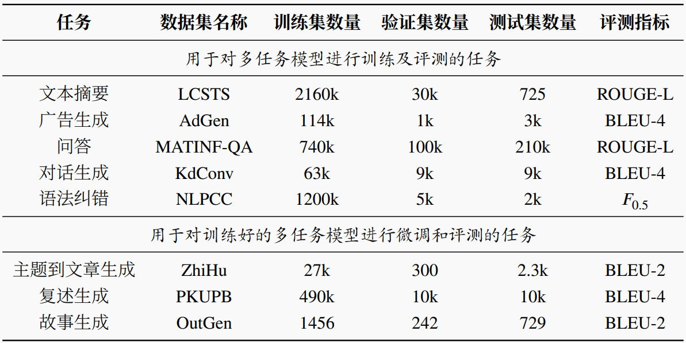
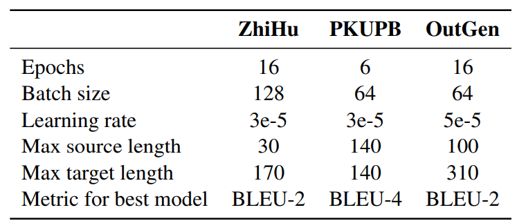

# 基于技能网络的通用自然语言生成模型

[数据集](#数据集) | [模型训练](#模型训练) | [模型评测](#模型评测)

## 简介

使用多任务训练的自然语言生成模型仅使用一个模型即可完成各种不同的自然语言生成任务。但是这种不同任务共享所有参数的模型无法清楚地知道模型的每一部分参数学到了什么技能。为了根据不同的任务选择激活不同的模型参数，该文提出了一种基于稀疏激活的通用自然语言生成模型（SkillNet-NLG）。与传统的稠密模型在执行任务时激活所有的模型参数不同， SkillNet-NLG 在执行任务时，首先依据任务预先定义一组完成任务所需要的技能，然后根据定义的技能选择性地激活与技能相关的模型参数。这种模型设计使其能够通过正确地选择与任务相关的技能来高效地学习新的任务。在中文自然语言生成任务上的实验结果表明，首先，在仅使用一个模型的情况下， SkillNet-NLG 在常见的五个自然语言生成任务中的四个上面超过了当前最好方法；其次， SkillNet-NLG 表现优于另外两类多任务基线模型（稠密模型和混合专家模型），并取得了与针对特定任务单独训练的模型相当的性能；最后，当应用到新任务上时， SkillNet-NLG 相较于所有基线方法取得了更好的结果，验证了所提出的方法对于学习新任务的有效性。

## 数据集

本工作使用的数据统计信息如下表所示。数据集[下载链接](https://stduestceducn-my.sharepoint.com/:f:/g/personal/liaojunwei_std_uestc_edu_cn/Ev_Qd1zYSBdJqqGfHWxC3BQBpraIL5DLA_lHOTcScyLixQ?e=mws5os)



## 模型训练

### 依赖环境

```
transformers==4.7.0
datasets==1.8.0
jieba
rouge
nltk 
```

### 多任务训练

多任务训练阶段每5000步保存一次检查点（checkpoint）。

```bash
bash scripts/run_pathway.sh   \
"adgen kdconv lcsts matinf nlpcc"   \ # tasks
model_type.gpu_info.function.extra_info   \ # training setting (see below details)
100000  \ # max steps
8   \ # train batch size
8   \ # evaluation batch size
1   \ # gradient accumulation steps
3e-5    \ # learning rate
512   \ # max source length
200     \ # max target length
4    \ # sampling temperature
v100 \ # taiji platform
optional_para # (optional parameter)
```

训练设置（training setting）由4个子设置组成：
`model_type.gpu_info.function.extra_info`. 

1. **model_type:**  设置模型类型
- `bart`: dense model (bart-large)
- `moe`: mixture-of-experts model
- `pathway`: SkillNet-NLG model
- `t5`: dense model (t5-base)
2. **gpu_info (optional):** 提供与GPU有关的额外记录信息，如gpu数量
3. **function:** 

| 可选项      | 解释                                                        |
| -------- | --------------------------------------------------------- |
| pretrain | 加载预训练的中文BART模型并从头开始训练                                     |
| resume   | 从`optional_para`参数指定的检查点加载模型恢复中断的训练过程                     |
| ckpt     | 加载`optional_para`参数指定的模型从头开始训练                            |
| skill    | 使用`optional_para`参数指定的技能模块训练模型（例如，`01`代表使用通用技能和开放式文本生成技能） |

4. **extra_info (optional):** 提供额外的记录信息

### 新任务微调

微调新任务的训练超参数如下：


新任务微调阶段，在每个回合（epoch）结束时对保存模型的检查点并在验证集上进行评测。微调结束时，使用验证集上表现最好的检查点的模型在测试集上进行评测。

```bash
bash scripts/run_single_task.sh   \
outgen   \ # task
model_type.gpu_info.function.extra_info    \ # training setting (see below details)
16   \  # number of train epochs
8    \ # train batch size
8   \ # evaluation batch size
1   \ # gradient accumlation steps
3e-5    \ # learning rate
100   \ # max source length
310  \ # max target length
bleu-2     \  # metric for best model when evaluating
optional_para # (optional parameter)
```

训练设置（training setting）由4个子设置组成： `model_type.gpu_info.function.extra_info`. 

1. **model_type:**  设置模型类型
- `bart`: dense model (bart-large)
- `moe`: mixture-of-experts model
- `pathway`: SkillNet-NLG model
- `t5`: dense model (t5-base)
2. **gpu_info (optional):** 提供与GPU有关的额外记录信息，如gpu数量
3. **function (optional):** 

| 可选项   | 解释                                                        |
| ----- | --------------------------------------------------------- |
| skill | 使用`optional_para`参数指定的技能模块训练模型（例如，`01`代表使用通用技能和开放式文本生成技能） |

4. **extra_info (optional):** 提供额外的记录信息

#### 使用多任务训练的所有检查点微调新任务

```bash
python scripts/run_single_task_ckpts.py     \
outgen   \ # task
model_type.gpu_info.function.extra_info    \ # training setting (see below details)
16   \  # number of train epochs
8    \ # train batch size
8   \ # evaluation batch size
1   \ # gradient accumlation steps
3e-5    \ # learning rate
100   \ # max source length
310  \ # max target length
bleu-2     \  # metric for best model when evaluating
path_of_checkpoints # path of checkpoints
```

训练设置（training setting）由4个子设置组成：`model_type.gpu_info.function.extra_info`. 

1. **model_type:**  设置模型类型
- `bart`: dense model (bart-large)
- `moe`: mixture-of-experts model
- `pathway`: SkillNet-NLG model
- `t5`: dense model (t5-base)
2. **gpu_info (optional):** 提供与GPU有关的额外记录信息，如gpu数量
3. **function & extra_info (optional):** 

| function                              | extra_info                                                           | 解释                                          |
| ------------------------------------- | -------------------------------------------------------------------- | ------------------------------------------- |
| ckpt[.*] (必须包括关键字 `ckpt`, 其他部分用于记录信息) | 检查点的范围（例如，5000_10000代表checkpoint_5000~checkpoint_10000）。为空表示使用所有检查点。 | 使用指定的多任务模型的检查点微调新任务。可用`extra_info`指定检查点的范围。 |

#### 超参搜索 epoch/batch size/learning rate

```bash
python scripts/tune_new_task.py   \
outgen    \ # task
model_type.gpu_info.function.extra_info  \ # training setting (see below details) 
"16"    \ # epoch candidates
"8 4 2 1"    \ # batch size candidates
"1e-5 3e-5 5e-5"  # learning rate candidates
```

训练设置（training setting）由4个子设置组成：`model_type.gpu_info.function.extra_info`. 

1. **model_type:**  设置模型类型
- `bart`: dense model (bart-large)
- `moe`: mixture-of-experts model
- `pathway`: SkillNet-NLG model
- `t5`: dense model (t5-base)
2. **gpu_info (optional):** 提供与GPU有关的额外记录信息，如gpu数量
3. **function:** 

| 可选项 | 解释                    |
| --- | --------------------- |
| hs  | 执行网格超参搜索（grid search） |

4. **extra_info (optional):** 提供额外的记录信息

## 模型评测

### 在多任务模型的所有检查点上评测所有任务

在所有检查点上使用验证集进行评测找出表现最好的模型，然后使用找到的最好模型在测试集上进行评测。以下脚本支持分布式模型推断，能够显著减少模型推断时间

```bash
python scripts/get_mlt_result_dist.py path_of_checkpoints
```

以下脚本支持在指定的检查点进行评测

```bash
python scripts/predict_dist.py path_of_checkpoint
```

### 新任务的评测

对新任务的评测会在训练结束时自动进行。也可以使用如下脚本手动进行评测

```bash
python3 scripts/eval/run_eval.py \
outgen \ # task
dataset/outgen/test.jsonl \ # reference jsonl file
checkpoints/outgen/bart_gpu8/ep16_bs16_lr3e-5_G1/predict_metrics.json # prediction jsonl file
```

例如，上述脚本对故事生成任务使用参考的句子和预测的句子计算BLEU-2分数。

## 模型检查点下载

多任务训练的SkillNet-NLG模型[下载链接](https://stduestceducn-my.sharepoint.com/:f:/g/personal/liaojunwei_std_uestc_edu_cn/Enjpp6hB02tCjgKe4CCM_3YBGOcZQ7WKDNmf-XrHydAc5g?e=wm0h7V)
